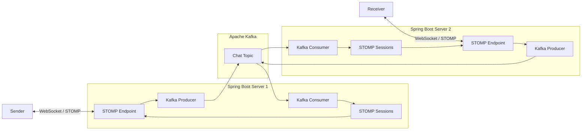
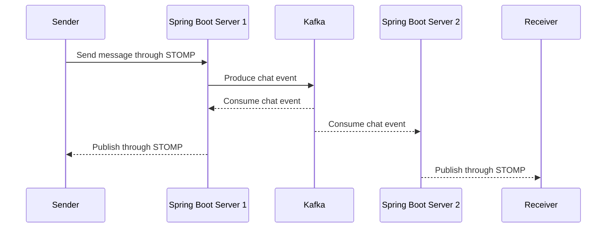
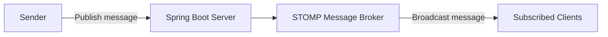
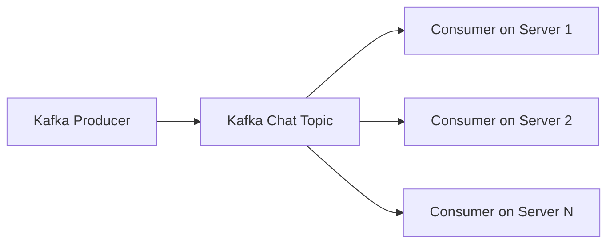
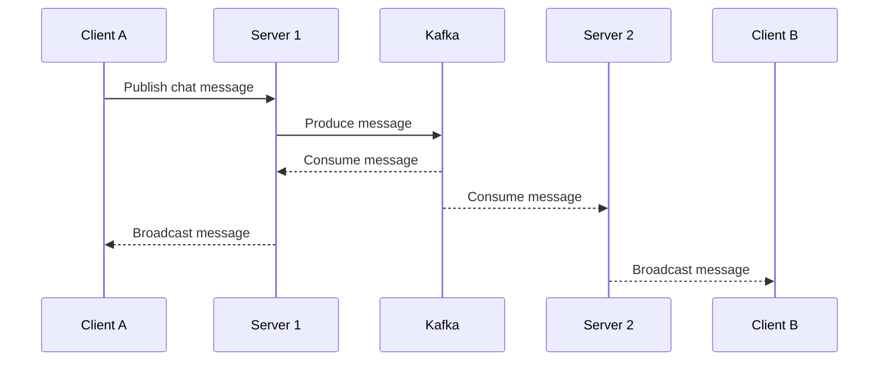

# Kafka with STOMP

A distributed real-time chat application built with **Spring Boot**, **Apache Kafka**, and **STOMP over WebSocket**.

The project demonstrates how Kafka can distribute chat messages across multiple application instances while STOMP delivers those messages to connected clients in real time.

---

## Output Example


---

## Project Goal

This project implements a real-time chat system designed for:

* Multi-user communication
* Low-latency message delivery
* Horizontal scalability
* Cross-server message distribution
* Server-independent WebSocket sessions

STOMP provides real-time communication between clients and the application server. Kafka distributes chat messages across multiple server instances so that users can communicate even when they are connected to different servers.

---

## Architecture



### Message Flow

1. A client connects to a Spring Boot server through a STOMP WebSocket endpoint.
2. The client publishes a chat message through STOMP.
3. The server forwards the message to Kafka through a Kafka producer.
4. Kafka stores the message in the chat topic.
5. Kafka consumers running on each server consume the message.
6. Each server publishes the consumed message to its local STOMP subscribers.
7. Clients receive the message regardless of which server they are connected to.



---

## What Is STOMP?

STOMP stands for **Simple Text Oriented Messaging Protocol**.

It is a text-based messaging protocol commonly used on top of WebSocket. The server exposes STOMP endpoints, and clients connect to those endpoints to publish messages or subscribe to destinations.

A basic STOMP chat flow works as follows:



STOMP alone is sufficient for implementing real-time chat on a single application instance.

However, each application server maintains its own WebSocket connections and STOMP sessions. In a multi-server environment, a message received by one server is not automatically delivered to clients connected to another server.

---

## Why Kafka?

Apache Kafka is a distributed event-streaming platform designed for high-throughput and reliable message processing.

Kafka organizes messages into topics:

* Producers publish messages to a topic.
* Kafka stores and distributes those messages.
* Consumers read messages from the topic.

In this project, Kafka acts as the communication layer between Spring Boot server instances.



Without Kafka, clients connected to different servers cannot reliably receive each other's messages because their STOMP sessions exist only in the memory of the server to which they are connected.

With Kafka:

* Message processing is decoupled from a specific server.
* Messages can be distributed across multiple application instances.
* Clients receive messages regardless of their connected server.
* Application servers can be scaled horizontally.
* Kafka provides a durable and centralized event stream.

### Distributed Chat Example



In this example:

* Client A is connected to Server 1.
* Client B is connected to Server 2.
* Client A sends a message through Server 1.
* Server 1 publishes the message to Kafka.
* Server 2 consumes the same message from Kafka.
* Server 2 delivers the message to Client B through STOMP.

This allows the chat system to operate consistently across multiple server instances.

---

## Technology Stack

* Java
* Spring Boot
* Spring WebSocket
* STOMP
* Apache Kafka
* Gradle
* Docker
* Zookeeper

---

## Development Timeline

* **2024-07-10** — Implemented Kafka configuration
* **2024-07-12** — Implemented STOMP configuration
* **2024-09-07** — Implemented additional backend components
* **2024-09-07** — Implemented application APIs
* **2024-09-07** — Implemented the chat user interface
* **2024-09-08** — Refactored frontend code and improved device compatibility

---

## Getting Started

### 1. Build the Project

```bash
./gradlew build
```

### 2. Start Kafka and Zookeeper

Run the provided `Makefile` before starting the Spring Boot application.

```bash
make
```

The current scripts may depend on the local Kafka installation path.

Update the relevant configuration when using:

* A different local Kafka installation
* Docker-based Kafka
* Amazon MSK
* Another externally managed Kafka cluster

### 3. Configure the Kafka Broker

Review the Kafka configuration before launching the application.

In particular, confirm the broker address configured in `KafkaConstant` and update it for your environment.

### 4. Run the Application

```bash
./gradlew bootRun
```

### 5. Open the Chat Application

Open the following address in a browser:

```text
http://localhost:8080
```

Open multiple browser windows or devices to test real-time chat communication.

---

## Docker

Review the provided `Dockerfile` before building the application image.

```bash
docker build -t kafka-with-stomp .
```

Run the image with the required Kafka broker configuration for your environment.

---

## Limitations

This project is a demonstration of distributed STOMP message delivery through Kafka.

Before using the architecture in production, additional concerns should be addressed, including:

* Authentication and authorization
* Persistent chat history
* Kafka consumer-group design
* Message ordering
* Duplicate-message handling
* Delivery guarantees
* Retry and failure handling
* WebSocket session management
* Monitoring and observability
* Secure broker and WebSocket connections
